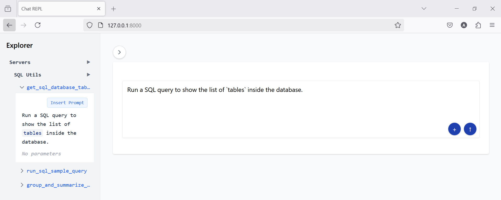

# Introduction

This is a small implementation of MCP Client in Django. The MCP Server is currently hard coded with the Django client application.

[MCP Documentation](https://modelcontextprotocol.io/)

### How does it work

- The MCP client sends 2 things to OpenAI via API call:
  - The user prompt received from the Django app
  - The list of available MCP Tools
- The OpenAI LLM reads the user prompts and evaluates if any tool from the received list of tools can be utilized
- If the LLM decides to use a tool, it fetches the Python arguments from the user prompt and feeds them to the tool, the tool is then called on the MCP Server side

Note: a tool is a Python function with a `mcp.tool` decorator.

# Screnshots

## Standard ChatGPT response


## Using MCP Server Tool for fetching tables


## Using MCP Server Tool for checking sample of data in database table


## Using MCP Server Tool for creating a bar chart


## Using Explorer Sidebar



# Running the demo

Update the configs:

- `SQLITE_PATH` inside `chatapp/chatapp/mcp/sql.py`
- All other configs in `chatapp/config.py`

Create Environment Variables:

- `OPENAI_KEY` storing the API Key of Open AI

Create a Python virtual environment and install all Python dependencies:

```bash
cd chatapp
uv sync
```

Activate the Python virtual environment:

```bash
.venv\Scripts\activate
```

Run the django server

```bash
python manage.py runserver
```

# Chat REPL

A chat application that allows you to interact with an AI assistant using natural language. The assistant can help you with various tasks, including writing and executing code, analyzing data, and answering questions.

## Features

- Natural language interaction with AI
- Code execution and visualization
- Markdown support with syntax highlighting
- Interactive data visualization
- Tool selection and management
- Real-time response streaming

## Prerequisites

- Python 3.8 or higher
- Node.js 16 or higher
- `uv` package manager (recommended for faster dependency installation)

## Installation

1. Clone the repository:
```bash
git clone <repository-url>
cd chatapp
```

2. Install Python dependencies using `uv`:
```bash
uv pip install -e .
```

3. Install Node.js dependencies:
```bash
npm install
```

## Running the Demo

1. Start the Django server:
```bash
python manage.py runserver
```

2. Open your browser and navigate to `http://localhost:8000`

3. Start chatting with the AI assistant!

### Running Tailwind

The application uses Tailwind CSS for styling. To compile the CSS:

1. Start the Tailwind CSS build process:
```bash
npm run build
```

This will:
- Watch your HTML files for changes
- Compile the CSS from `static/css/input.css` to `static/css/output.css`
- Automatically rebuild when you make changes

The build process will continue running until you stop it (Ctrl+C). You can leave it running while developing.

## Project Structure

```
chatapp/
├── chatapp/
│   ├── __init__.py
│   ├── app.py
│   ├── config.py
│   ├── mcp/
│   │   ├── __init__.py
│   │   └── client.py
│   ├── static/
│   │   ├── css/
│   │   │   ├── input.css
│   │   │   └── output.css
│   │   └── js/
│   │       └── main.js
│   └── templates/
│       ├── index.html
│       ├── input_cell.html
│       ├── output_cell.html
│       └── sidebar.html
├── pyproject.toml
├── package.json
└── tailwind.config.js
```
